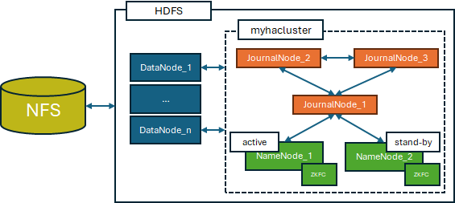
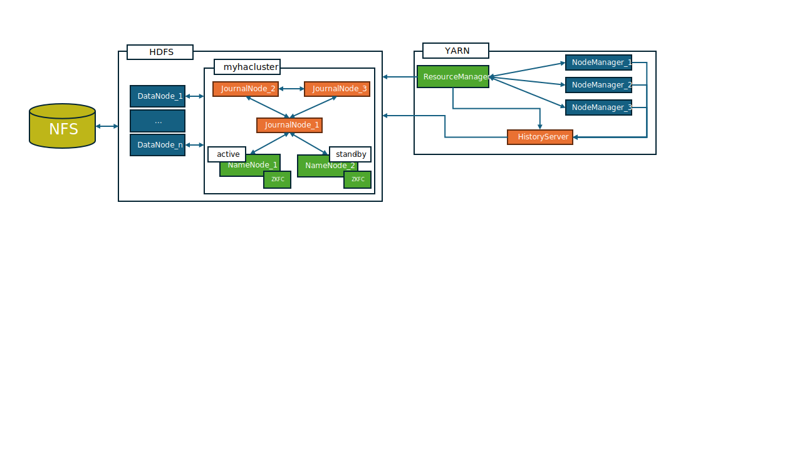

---
Data Platform Documentation"
---
Services
1.  Hadoop HDFS, version: 3.3.6

2.  Hadoop YARN, version: 3.3.6

3.  Spark, version: 3

# **Hadoop**

## **HDFS**

### **Mode**

**High-Availability**: two or more NameNodes are grouped into a **nameservice** (*myhacluster*).

-   One active namenode per time.

-   Only active namenode manages requests.

-   Stand-by namenodes stay updated thanks to JournalNodes

-   Every action performed by *active* namenode is logged through journals: the policy is to write on the majority of Journal Nodes.

-   Each component data is persisted through a NFS. Each component has its own directory inside NFS.

-   **High-availability is resolved client-side. Configuration must be shared between NameNodes, JournalNodes and HDFS clients**. Two default ways (we're using RequestHedgingProvider) of communicating with a nameservice. For this and a basic HDFS-HA setup, take a look at the [[official doc]](https://hadoop.apache.org/docs/stable/hadoop-project-dist/hadoop-hdfs/HDFSHighAvailabilityWithQJM.html)

### **Configuration**

Configuration properties define the cluster setup, how services find and interact with each other and _how clients can communicate with the hadoop cluster_.
Configuration can be passed to HDFS services (using apache/hadoop docker image) in two ways.

#### **Configuration file**

It's a simple *.conf* file which will be parsed into environmental variables in the container and then parsed into hdfs properties. Such file should have the following syntax:

> *CORE-SITE.XML_hadoop.http.staticuser.user=root*

where the "\_" and "=" are split characters _and thus only one occurrence of each should appear in the property string_ and the first part refers to the Hadoop property file this property belongs to (core-site.xml), the middle parte refers to the property name (hadoop.http.staticuser.user) and the third part of the split refers to the value of such property (root). Such .conf file needs to be passed as *env_file* inside the docker stack file.

#### **Property files**

HDFS configuration depends on multiple files, most importantly:

-   **core-site.xml**
Contains properties that help communication with/between hadoop services, e.g.
> *CORE-SITE.XML_fs.defaultFS=hdfs://myhacluster.*

An example of core-site.xml with a description of each possible variable can be found in the [[official template]](https://hadoop.apache.org/docs/r2.8.0/hadoop-project-dist/hadoop-common/core-default.xml)

-   **hdfs-site.xml**
Contains the configuration of the HDFS High-Availability cluster, common properties that help communication with/between hadoop services and settings for the HDFS website.
An example of hdfs-site.xml with a description of each possible variable can be found in the [[official
template]](https://hadoop.apache.org/docs/r2.4.1/hadoop-project-dist/hadoop-hdfs/hdfs-default.xml)

-   **capacity-scheduler.xml**
Contains properties related to YARN and resource allocation. An example of hdfs-site.xml with a description of each possible variable can be found in the [[official doc]](https://hadoop.apache.org/docs/stable/hadoop-yarn/hadoop-yarn-site/CapacityScheduler.html)

-   **yarn-site.xml**
 Contains properties related to YARN and resource allocation and the configuration for YARN websites (ResourceManager, NodeManager  HistoryServer). An example of hdfs-site.xml with a description of each possible variable can be found in the [[official template]](https://hadoop.apache.org/docs/r2.7.3/hadoop-yarn/hadoop-yarn-common/yarn-default.xml)**.**
Other "minor" property files:

-   **hadoop-policy.xml**
-   **hadoop-env.sh**
	Can define variable that will be translated into environmental variables when the hadoop service is started _you won't see these variables on container setup!_

-   **hdfs-rbf-site.xml**

-   **httpfs-site.xml**

-   **kms-acls.xml**

-   **kms-site.xml**

-   **log4j.properties**
     Defines properties about service logs

-   **mapred-env.sh**

-   **mapred-site.xml**

**Property files must be passed to the container and placed inside the \$HADOOP_CONF_DIR folder**

### **Components**

#### **JournalNode**

They are a passive component. Must be in an odd number \> 3. They are responsible for logging every transaction occured in the HDFS. the *active* namenode does and for keeping the state of the high-availability cluster always consistent. They NEED the same configuration passed to NameNodes and DataNodes since they will need to communicate between each-other. After
setup, they will be contacted by the two NameNodes (once their setup is completed) which will register to the JournalNodes, which will create the NameNode folder to store its logs and start the synching process. On cluster setup, they need to be formatted just as namenodes.

Three main params needed:

-   NameNodes address

-   Other journals address

-   Log directory path

Periodically, JournalNodes will synch with each-other to grant consistency between their logs. Every time the active namenode performs an action, it logs the operation on **a majority** of JournalNodes. The standby namenode will constantly synch with the journalnodes to stay updated on the HDFS state.
Whenever a NameNode switches from *stand-by* state to *active* state, it contacts the journal nodes to assure its state is
consistent.
They don't expose interfaces to users.

#### **NameNode**

Active component. On first cluster setup, it needs to be formatted

	hdfs --config ${HADOOP_HOME}/etc/hadoop namenode -format ${CLUSTERNAME}

If the NameNode you're starting is a stand-by node, it should be formatted and put to stand-by, e.g.

	hdfs namenode -bootstrapStandby

After formatting (if needed), namenodes must be started.

	hdfs --config $HADOOPCONFDIR namenode

it registers itself to the JournalNodes. Namenodes should be started after journal nodes are up and running. Namenodes expose three interfaces:

-   **rpc-address**
	 Contains the address to which clients should send RPCs. It can be defined in hdfs-site.xml. e.g.
	> *dfs.namenode.rpc-address.myhacluster.nn2=namenode2:8020*
	
-   **service-rpc-address**
	 Contains the address to which services should send RPCs. It can be defined in hdfs-site.xml. e.g.
	> *dfs.namenode.servicerpc-address.myhacluster.nn2=namenode2:8021*

-   **http-address**
	Contains the address in which the namenode will expose its web UI. It can be defined in hdfs-site.xml. e.g.
	> *dfs.namenode.http-address.myhacluster.nn2=namenode2:9870*

These addresses are used for client purposes as much as setup options, so in case of multiple coexisting networks (as in Docker Swarm) it is mandatory that namenodes bind on address 0.0.0.0 in order to be able to fetch communication from each network. This can be done by setting the following properties:
> *dfs.namenode.http-address.myhacluster.nn1=0.0.0.0:9870*

> *dfs.namenode.servicerpc-bind-host0.0.0.0*

>  *dfs.namenode.rpc-bind-host:0.0.0.0*

	
Once both NameNodes have started, one of them must be elected **active** (if there isn't already an active namenode defined)**.** Namenodes election and eventual failovers can be implemented two ways:

-   **Manually**: default mode, manually switch the active namenode, e.g.

	    hdfs haadmin -transitionToActive {namenode_id}

-   **Automatically**: requires a ZooKeeper quorum. To enable automatic election and failover control of Namenodes, the following property needs to be set to true in *hdfs-site.xml*
	 >dfs.ha.automatic-failover.enabled=true
	 
	 Once setting up a ZooKeeper cluster with an odd n > 3 servers, Namenodes can be configured to identify such quorum via 		a *core-site.xml* property
 	> ha.zookeeper.quorum={zookeeper1_address}:2181,{zookeeper2_address}:2181,{zookeeper3_address}:2181
 	
	If automatic failover is enabled then before starting up, one of the two namenodes must create a znode in the ZK quorum via
	
		hdfs zkfc -formatZK -nonInteractive
	Upon creation of the znode and once again before startin the namenode process, a ZooKeeper Failover Controller daemon must be started on all the machine hosting namenodes via

		hdfs --daemon start zkfc
		
	Each of the ZKFC  will then initiate a session with the ZK quorum and try to get a lock on the previously created znode. The one namenode that successfully acquires the lock becomes the active namenode. The ZKFC on the other namenodes will then inform its namenode to go into standby mode. Periodically (5s by default), the ZKFC sends a ping to its namenode as a health check and in case of *one* missing health check they  proceed to close the  previouvsly initiated session with the ZK quorum, initiating a failover.

#### **DataNode**

Doesn't need much setup if not for the same configuration passed to NameNodes and Journal Nodes. On setup, DataNodes **actively** contact the active NameNode and register themselves to it. It's not the other way around, namenodes don't need to know apriori who and where the data nodes are, they will know where they are once they register to them.
They send heartbeats and block location information updates on both the active and the stand-by namenode.

### **Communication**

Each service endpoints are defined and exposed through property files. *In Hadoop, each entity is also an HDFS client* which leverages property files to know where to find other services. _The resolution of which namenode is the active happens **client-side**. This means that if you want to add a container to the cluster and want to be able to interact with HDFS, not only should it have HDFS installed in it but it should contain  all the property files definint the the HA cluster's configuration._

There are two ways of determining who is the active NameNode, and the preferred way can be specified inside hdfs-site.xml by specifying one of the two default methods:

-   **ConfiguredFailoverProxyProvider**: The active namenode is determined by the ZKFC.

-   **RequestHedgingProxyProvider**: for the first call, concurrently invokes all namenodes to determine the active one, and on subsequent requests, invokes the active namenode until a fail-over happens.

### **Setup Requirements**

-   On first-cluster-startup, there's a strict order to follow: JournalNodes -> Active NN -> Passive NN.

## YARN

It comes from the same Docker Hub Image as HDFS, so in terms of configuration the same two modalities exists:

 - **Configuration files**
 - **Property files**
 
In terms of property files, YARN relies on the same file HDFS does, meaning that property files should be shared between these two and consistency granted.
Specifically, *yarn-site.xml* allows to define network configurations and services' addresses. Needless to say, each YARN service must share the same configuration.

### ResourceManager
### NodeManager
Upon creation it registers to the ResourceManager.
### HistoryServer
Logs data into HDFS.

# SPARK
